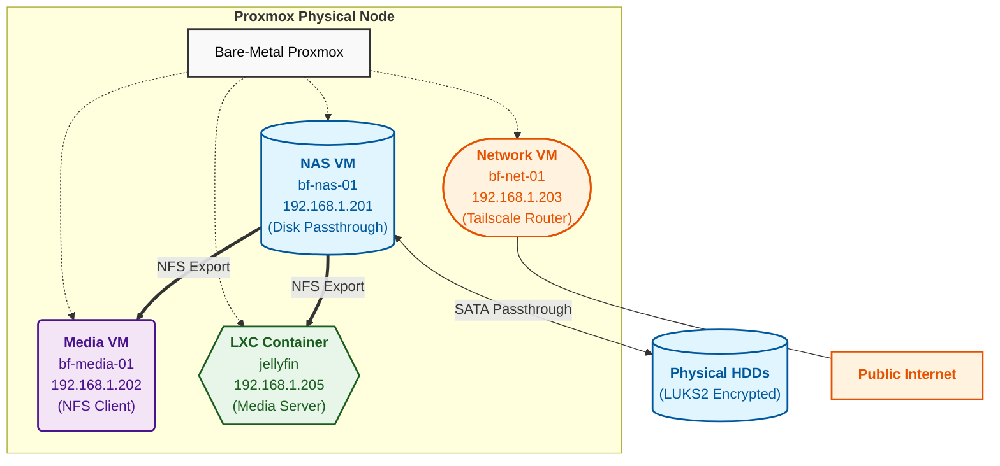
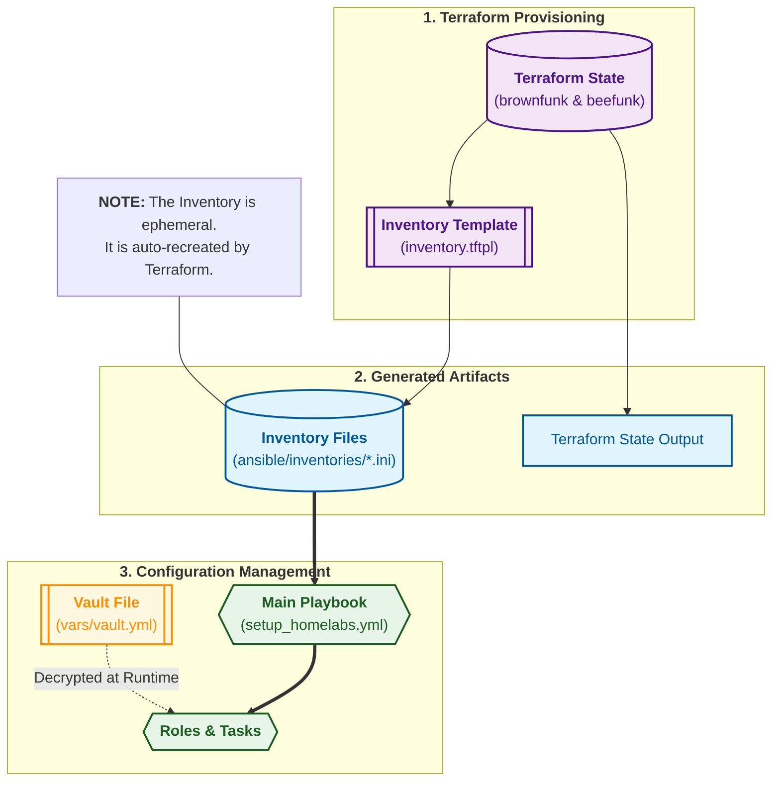

## Infrastructure Overview
This repository delivers a streamlined homelab automation framework optimized for modest, hobbyist environments with limited hardware. It provides a unified control plane for both provisioning and configuration, ensuring reproducibility, simplicity, and ease of maintenance.

### Core Components
- **Terraform**
  - Declaratively provisions VMs and LXC containers on Proxmox across multiple nodes (`brownfunk` and `beefunk`) using parameterized modules and maps.
  - Generates dynamic Ansible inventories and export files via `local_file` and template resources, closing the loop between infrastructure and configuration.

  Example (`terraform/brownfunk/variables.tf`):
  ```hcl
  vm_fleet = {
    "bf-nas-01" = {
      id        = 181
      ip        = "192.168.1.201"
      cores     = 1
      memory    = 4096
      disk_size = 10
      is_nas    = true
    }
  }
  ```
- **Ansible**
  - Applies post-provisioning system and user configuration through top-level playbooks (`setup_homelabs.yml`, `local.yml`, `remote.yml`).
  - Organizes tasks into modular directories (`tasks/`, `templates/`, `vars/`), leverages tags for targeted execution, and secures secrets with Ansible Vault.

  Inventory example (`ansible/inventories/brownfunk.ini`):
  ```ini
  [nas_servers]
  bf-nas-01 ansible_host=192.168.1.201

  [media_servers]
  bf-media-01 ansible_host=192.168.1.202
  ```
- **Containers & Services**
  - Uses Docker and LXC to isolate services such as media servers, Pi-hole, and Jellyfin, simplifying deployment, scaling, and updates.
  - Employs `community.docker.docker_compose_v2` for declarative lifecycle management of containerized applications.
- **Testing & Quality Assurance**
  - **Molecule** with **Testinfra** validates Ansible roles in ephemeral containers, ensuring idempotency and behavior correctness.
  - **Pylint** enforces coding standards on custom modules (e.g., `ansible/evandam.conda/library/conda.py`).
- **User-Space Package Management**
  - **Homebrew/Linuxbrew** provides non-privileged installation for development tools, ideal for environments with restricted sudo permissions.

### Design Principles
- Minimal footprint: Tailored for home servers with limited CPU, RAM, and storage resources.
- Idempotency & Transparency: Terraform and Ansible guarantee a consistent end state; debug tasks and logs provide clear insights into operations.
- Modularity & Reusability: A clear separation between provisioning (Terraform) and configuration (Ansible), with reusable modules and roles.
- Simple Onboarding: Dynamic inventory generation and a single orchestrating playbook streamline adding or refreshing nodes.

## The "New Server" Workflow

## The Handover and Automated Inventory Generation
- **Inventory Automation**: 
  - Terraform uses `local_file` resources along with inventory templates (`inventory.tftpl`) to generate inventory files for each environment:
    - **terraform/brownfunk** produces an inventory tailored for the Brownfunk node.
    - **terraform/beefunk** generates its own separate inventory file, ensuring distinct configurations.
- **Vault Integration & Templates**:
  - Sensitive data is managed via Ansible Vault (e.g., `vars/vault.yml`) and injected into playbooks as needed.
  - Inventory templates dynamically embed project-specific variables and secrets, ensuring seamless coordination during deployments.
- Updates (e.g., adding or modifying nodes) automatically trigger inventory regeneration, linking configuration files, templates, and secure vault data.

### Disk Configurations & Encryption
- **Disk Configurations**:
  - The `vars/vault.yml` file stores encrypted disk credentials (e.g., LUKS2 passphrases) and custom mount settings under a `disk_configs` mapping.
  - Each entry defines:
    - `parent_path`: the base directory for mounting.
    - `name`: the subdirectory name used for the mount point.
    - `fstype`: the filesystem type (e.g., `ext4`, `xfs`, `btrfs`).
    - `luks_password` (optional): the LUKS2 encryption key for unlocking volumes.

  Example (`vars/vault.yml`):
  ```yaml
  disk_configs:
    "/dev/disk/by-id/usb-Example-0:0":
      parent_path: "/media"
      name: "data"
      fstype: "xfs"
      luks_password: "vault_passphrase"
  ```
- **Storage Setup Playbook**:
  - `ansible/tasks/storage_setup.yml` reads `passthrough_disks`, converts JSON strings via `from_json` when needed, and builds a `disk_map` of device IDs to partition paths.
  - It ensures mount directories exist, unlocks encrypted volumes using `cryptsetup` if `luks_password` is provided, and writes entries to `/etc/crypttab`.

  Task snippet (`ansible/tasks/storage_setup.yml`):
  ```yaml
  - name: "Storage: Map Slots to VM Persistent IDs"
    set_fact:
      disk_map: "{{ disk_map | default({}) | combine({ item.id: '/dev/disk/by-id/scsi-0QEMU_QEMU_HARDDISK_drive-scsi' ~ item.slot ~ '-part1' }) }}"
    loop: "{{ disks_to_process }}"
  ```
  - It retrieves UUIDs for unencrypted disks via `blkid` and mounts them with the appropriate `fstype`, updating `/etc/fstab` and mounting via `ansible.posix.mount`.
- **Supported Filesystems**:
  - The playbook supports common filesystems (`ext4`, `xfs`, `btrfs`) by templating mount entries with correct options and ensuring idempotent mounts.
  
## The "New Server" Workflow
When adding a new server, it is critical to follow the established naming conventions and understand the purpose of each VM type. The primary types include:
- **NAS Servers** (e.g. `bf-nas-01` or `bee-nas-01`): These nodes handle shared storage with NFS exports and disk passthrough.
- **Media Servers** (e.g. `bf-media-01` or `bee-media-01`): Responsible for managing containerized media services.
- **Network Servers** (e.g. `bf-net-01` or `bee-net-01`): Dedicated to networking, routing, and Tailscale operations.
- **Development Servers** (e.g. `bf-dev-01` or `bee-dev-01`): Provide development environments for various projects.

Each VM entry is defined in Terraform’s `vm_fleet` map with specific parameters such as unique VM IDs, IP addresses, CPU cores, memory allocation, disk sizes, and (for NAS nodes) a flag `is_nas` along with associated physical disks. IP addresses and gateways are preconfigured per environment (e.g., Brownfunk uses gateway `192.168.1.1` while Beefunk uses `192.168.8.1`).

**Steps to add a new server:**
1. **Terraform Variable Update**:
   - Identify the correct environment: edit `terraform/brownfunk/variables.tf` for Brownfunk or `terraform/beefunk/variables.tf` for Beefunk.
   - In the `vm_fleet` map, add a new key following the naming pattern (`bf-<type>-NN` or `bee-<type>-NN`), where `<type>` is one of `nas`, `media`, `net`, or `dev` and `NN` is the next sequential number.
   - Specify the VM parameters (ID, IP, cores, memory, disk size) and set `is_nas=true` if it is a NAS server.
2. **Provisioning**:
   - Run `terraform apply` from the corresponding directory. This updates the Terraform state, provisions the hardware, and regenerates the Ansible inventory via the `inventory.tftpl` template.

     Example:
     ```bash
     cd terraform/brownfunk && terraform apply
     ```
   - Note that the IP addresses and gateway configurations are set based on your Terraform variables.
3. **Ansible Inventory & Playbook Execution**:
   - The generated inventory file will be located in `ansible/inventories/` (e.g., `brownfunk.ini`), with VMs grouped under `[nas_servers]`, `[media_servers]`, `[network_servers]`, and `[dev_servers]`.
   - Execute the main playbook:
     ```bash
     ansible-playbook -i ansible/inventories/brownfunk.ini setup_homelabs.yml
     ```
   - This playbook runs tasks defined in `ansible/setup_homelabs.yml`, such as hostname configuration, package installations, Avahi setup, Docker services, and NFS exports.
   
**Additional Considerations**:
- **Naming Conventions**: Use prefixes (`bf-` for Brownfunk, `bee-` for Beefunk) consistently to ensure proper grouping and task execution in Ansible.
- **IP & Gateway Details**: Each VM's IP must be within the defined subnet, and the correct gateway (e.g., `192.168.1.1` or `192.168.8.1`) must be specified. These are validated during provisioning.
- **Server Roles**: Review the tasks in `ansible/setup_homelabs.yml` and the group definitions in `ansible/inventories/brownfunk.ini` to understand each server’s responsibilities.

Following these steps and considerations will ensure a robust process when adding new nodes to your infrastructure.

## VM Roles and Purposes

- **NAS Servers**:  
  These nodes (e.g., `bf-nas-01` or `bee-nas-01`) are dedicated storage providers. They manage NFS exports and disk passthrough of physical disks defined in Terraform. Tasks like configuring `/etc/exports` via the `exports.j2` template and running storage setup playbooks ensure all other nodes can reliably access shared data.

- **Network Servers**:  
  Represented by entries such as `bf-net-01` or `bee-net-01`, these servers are responsible for network services. They configure network routing (e.g., via Tailscale in `ansible/tasks/tailscale.yml`), adjust DNS settings, and serve as gateways for secure data transmission across the infrastructure.

- **Media Servers**:  
  Typical examples include `bf-media-01` (and planned `bee-media-01`). These servers focus on deploying containerized media applications using Docker (see `ansible/tasks/docker_services_up.yml` and related tasks). They also integrate with Homebrew and NFS mounts to access media libraries hosted by the NAS servers.

- **Development Servers**:  
  With names like `bf-dev-01` or `bee-dev-01`, these nodes provide environments tailored for development and testing. They install developer tools, manage dotfiles, and set up necessary packages (via tasks such as `ansible/tasks/packages.yml` and `ansible/tasks/dotfiles.yml`) to support coding and system experimentation.

- **Jellyfin LXC Container**:  
  Deployed as a Linux container (configured in `terraform/beefunk/lxc_containers.tf` and managed by `ansible/tasks/cook_jellyfin.yml`), the Jellyfin container leverages hardware acceleration (e.g., GPU passthrough) to optimize media streaming performance. It runs Jellyfin with tailored NFS mounts from the NAS and is isolated for improved media processing.

## Ansible File Mapping and Configuration Structure
- **Variable Organization**: 
  - Core variables are maintained in `vars.yml` and `vars/paths.yml`, ensuring consistency across configurations.
- **Host and Group Variables**:
  - `group_vars/` and `host_vars/` hold environment and node-specific settings.
- **Roles**:
  - Reusable roles (e.g., for Conda, Docker, network services) encapsulate detailed configuration procedures.
- **Playbooks**:
  - The primary playbook (`setup_homelabs.yml`) orchestrates all tasks, while incorporating dependencies from inventory templates, vault files, and role definitions.

## Proxmox Topology Diagram



## Visual Logic and Dependency Mapping



## Naming Conventions and Tagging Strategies
- **Resource Naming**:
  - Terraform enforces naming patterns through prefixes (`bf-` for Brownfunk and `bee-` for Beefunk) and structured names (e.g., `bf-nas-01`, `bee-media-01`).
- **Tagging in Ansible**:
  - Tags such as `docker`, `brew_install`, and `packages` enable precise targeting of tasks.
  - This systematic approach to naming and tagging ensures clarity during troubleshooting and scalability of the infrastructure.

**Important Note**: The clear separation between **brownfunk** and **beefunk** configurations supports independent management and evolution of each node's infrastructure, ensuring that updates in one environment do not inadvertently affect the other.
